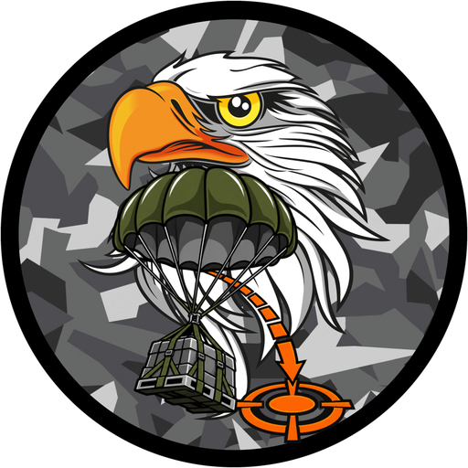
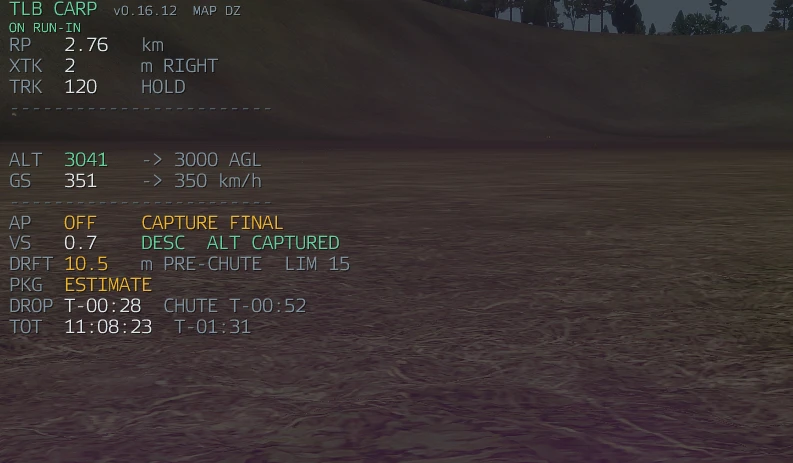
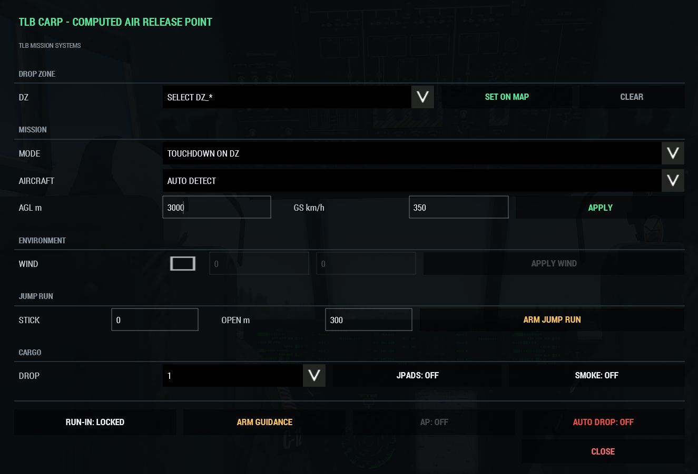
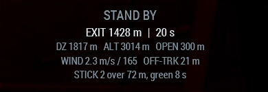
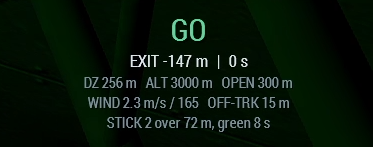
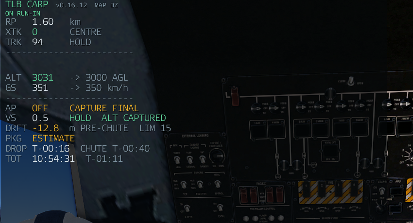
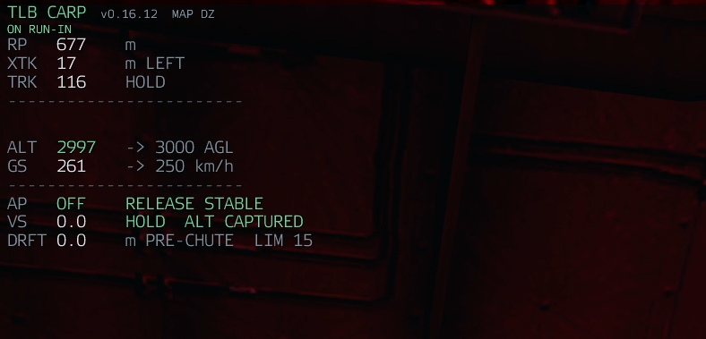

<p align="center">
  
</p>

<h1 align="center">TLB CARP</h1>

<p align="center">
  A Computed Air Release Point for Arma 3.<br>
  <strong>Put the load on the drop zone, not near it.</strong>
</p>

<p align="center">
  <a href="https://github.com/TLB-MilSim/TLB-CARP/wiki">Wiki</a> ·
  <a href="https://github.com/TLB-MilSim/TLB-CARP/wiki/Quick-Start">Quick start</a> ·
  <a href="https://github.com/TLB-MilSim/TLB-CARP/wiki/Pilot-Guide">Pilot guide</a> ·
  <a href="https://github.com/TLB-MilSim/TLB-CARP/wiki/Jump-Run">Jump run</a> ·
  <a href="https://github.com/TLB-MilSim/TLB-CARP/wiki/Mission-Making">Mission making</a> ·
  <a href="https://github.com/TLB-MilSim/TLB-CARP/wiki/Settings">Settings</a> ·
  <a href="https://github.com/TLB-MilSim/TLB-CARP/wiki/Troubleshooting">Troubleshooting</a>
</p>

<p align="center">
  
</p>

---

## What it is

CARP works out where you have to let go of a load so it lands on the drop zone.

Not from a table, and not from where you *planned* to be. It reads the aircraft you are
actually flying — height, speed, climb or descent, and the wind — and re-solves the whole
problem several times a second. Fast, and the release point moves back. Low, and it moves
forward. You can be off plan and still be on target.

- **Live release point.** Re-solved continuously, so a high or fast aircraft still drops
  accurately instead of being told it is out of parameters.
- **Autopilot.** Intercepts the run-in, captures it, holds height and speed through the
  release, and flies with control forces so it banks and pitches like an aeroplane.
- **Auto drop with a gate.** Releases at the right instant, and refuses a pass that is off
  the line, off the heading, or carrying too much sideways drift.
- **Cargo, loaded and dropped.** Its own loading, plus USAF, ACE and vehicle-in-vehicle
  loads. Sticks come out back to front, spaced along the run-in.
- **Guided cargo (JPADS).** Canopies steer themselves onto the drop zone after opening.
- **Jump run.** A computed exit point for HALO, an audible countdown, and the jumplight
  driven for the whole stick — and a green light refused when it cannot be honoured.
- **Time on target.** Tracks each load from release through canopy to impact.
- **One CARP per aircraft.** Everyone aboard with a CARP Computer shares the same drop.

## Screenshots

| The panel | The jump readout |
| --- | --- |
|  | <br> |

| Capturing the final line | Release stable |
| --- | --- |
|  |  |

## Requirements

| | |
| --- | --- |
| Arma 3 | v2.14 or newer |
| [CBA_A3](https://steamcommunity.com/workshop/filedetails/?id=450814997) | required |
| [ACE3](https://steamcommunity.com/workshop/filedetails/?id=463939057) | required — CARP opens from the ACE interaction menu |
| [USAF Mod](https://steamcommunity.com/workshop/filedetails/?id=2397360831) | optional — its C-17 and C-130J are the calibrated airframes, but CARP runs its own loading and release |
| [Free Fall Off The Ramp](https://steamcommunity.com/workshop/filedetails/?id=2654268308) | optional — drives the jumplight on a jump run |

## Installation

1. Load `@TLB_CARP_System` together with CBA_A3 and ACE3.
2. **On a server, load it on the server as well as every client.** Cargo is usually owned
   by the server, and that is the machine that performs the release.
3. Give aircrew a **CARP Computer** (Arsenal, a loadout, or Zeus → Equipment), or turn off
   *Require CARP Computer* in Addon Options.

> **Server admins:** releases are signed. Copy `keys/tlb_carp.bikey` from
> the mod folder into the server's `Keys/` folder and `verifySignatures = 2` works as
> normal. One persistent key — install it once, not per release.

## Quick start

1. Get aboard with a CARP Computer, press **Interact** at the airframe → **TLB CARP**.
   (Or bind *Open TLB CARP* under Options → Controls → Configure Addons.)
2. **SET ON MAP** and click your drop zone, or pick a `DZ_*` marker.
3. Set **TARGET AGL** and **TARGET GS**, then **APPLY**.
4. Roll out on the heading you intend to drop on, let it settle, then press **RUN-IN** to
   lock it. CARP locks the track you are *actually flying*, so do not lock in a turn.
5. **ARM GUIDANCE** — the HUD comes alive. Fly it like an ILS.
6. **AUTO DROP** to let it release, or fly the cue and drop by hand. **AP** will fly the
   run-in for you.

The [pilot guide](https://github.com/TLB-MilSim/TLB-CARP/wiki/Pilot-Guide) walks through all of it, and
[The HUD](https://github.com/TLB-MilSim/TLB-CARP/wiki/The-HUD) explains every row on the instrument.

## Crew

Everyone in the aircraft carrying a CARP Computer shares one CARP. Any of them can set the
DZ, lock the run-in, change the mode or arm guidance, and the others see it within a
second. Edits are merged field by field on the server, so two people changing different
things at the same moment both keep their change. The panel's **CREW** line shows which
record you hold and who changed it last.

The autopilot and the release command stay with whoever is flying.

## Accuracy

Measured on flown drops, not estimated. Radial error at touchdown.

| | |
| --- | --- |
| Unguided C-130J, live wind, 1485 m at ~383 km/h | **19.3 m** |
| Unguided C-17, same conditions | **21.1 m** |
| Guided cargo (JPADS), zero wind | **0.76 m** |
| Guided cargo, 10 m/s wind | **1.15 m** |
| Jump run exit cue | **7 m** and **12 m** on two flown runs |

The C-17 is fully calibrated; the C-130J has a measured zero-wind baseline and borrows the
C-17's wind deltas. Any other aircraft uses the C-17's numbers and solves normally — there
is no warning tier and auto drop is not gated. What does not carry over is the accuracy
claim above, which was measured on the calibrated airframes.
The guided figures were measured with the steering running on a client, not a dedicated
server — treat them as very good rather than exact.

## Documentation

**The [wiki](https://github.com/TLB-MilSim/TLB-CARP/wiki) is the documentation.** It is the one copy, and it is kept
current with the mod.

| Page | For |
| --- | --- |
| [Quick Start](https://github.com/TLB-MilSim/TLB-CARP/wiki/Quick-Start) | A drop in six steps. |
| [Pilot Guide](https://github.com/TLB-MilSim/TLB-CARP/wiki/Pilot-Guide) | Aircrew: the panel, the HUD, the run-in, cargo, autopilot, auto drop. |
| [The HUD](https://github.com/TLB-MilSim/TLB-CARP/wiki/The-HUD) | Every row, phase, state and message on the instrument. |
| [Cargo](https://github.com/TLB-MilSim/TLB-CARP/wiki/Cargo) · [Guided Cargo](https://github.com/TLB-MilSim/TLB-CARP/wiki/Guided-Cargo) | Loading, sticks, and canopies that steer themselves. |
| [Jump Run](https://github.com/TLB-MilSim/TLB-CARP/wiki/Jump-Run) | Jumpmasters: the exit point, the countdown, the jumplight. |
| [Crew and Multiplayer](https://github.com/TLB-MilSim/TLB-CARP/wiki/Crew-and-Multiplayer) | What is shared, who owns what, and what the server must run. |
| [Settings](https://github.com/TLB-MilSim/TLB-CARP/wiki/Settings) | Admins: all 31 addon options with default, range and owner. |
| [Mission Making](https://github.com/TLB-MilSim/TLB-CARP/wiki/Mission-Making) | DZ markers, the item, servers, aircraft support, script hooks. |
| [How It Works](https://github.com/TLB-MilSim/TLB-CARP/wiki/How-It-Works) · [Accuracy](https://github.com/TLB-MilSim/TLB-CARP/wiki/Accuracy) | The solver, the path manager, and what each measured figure is worth. |
| [Troubleshooting](https://github.com/TLB-MilSim/TLB-CARP/wiki/Troubleshooting) | Everyone: symptom first, then what to check. |
| [Changelog](https://github.com/TLB-MilSim/TLB-CARP/wiki/Changelog) | What changed, and how an entry gets written. |
| [Contributing](CONTRIBUTING.md) | Anyone changing the mod: how work lands in this repository. |

## Known limits

- **Multiplayer is source-verified, not flown.** Everything from v0.10.0 onwards — the
  release split, cargo loading, stick slots, the jump broadcast and the force autopilot —
  still needs a two-player dedicated-server pass.
- **Guided accuracy on a dedicated server is unmeasured.** The canopy is flown by the
  server there, at its frame rate.
- Signing is new in 1.0.0 and has not yet been through a live `verifySignatures = 2`
  connection. The signatures verify against `DSCheckSignatures`.
- The autopilot holds a fixed height above the DZ; it does not terrain-follow.
- Unguided accuracy in strong wind is limited by canopy scatter, not by the calibration.

## Building from source

```bash
python -m unittest discover -s tests -v
```

```bash
python tools/build_release.py --version 1.0.0.0 --label my-change --deploy "E:/@TLB_CARP_System"
```

```bash
python tools/gen_assets.py        # inventory icon and launcher logos
python tools/gen_banners.py       # Steam Workshop banners and preview
```

A release contains two addon files: `TLB_CARP_System.pbo` (the drop computer) and
`TLB_CARP_Items.pbo` (the CARP Computer and the logo).
[CONTRIBUTING.md](CONTRIBUTING.md) covers how a change gets into this repository.

Three things here cost a day each if you do not know them:

- **`addon/config.cpp` is the source and `addon/config.bin` is built from it** with Arma 3
  Tools' CfgConvert. The binary is what ships, so a `.cpp` edit that is not rebuilt does
  nothing in game.
- **A new function reaches the engine only through the compile table** in
  `addon/functions/fn_postInit.sqf`, and a new file has to be `--include`d in its first
  release build.
- **Some `.sqf` files ship with a compiled `.sqfc` sibling that shadows them** at load. If
  a change appears to do nothing in game, look for one before theorising.

## Licence

TLB CARP is licensed under the
**[Arma Public License No Derivatives (APL-ND)](https://www.bohemia.net/community/licenses/arma-public-license-nd)**.
You may share it unmodified, for non-commercial use, with attribution. You may not modify
it or publish derivative works, and it may only be used with Bohemia Interactive's Arma
games. See [`LICENSE`](LICENSE).

The **TLB** and **TLB MilSim** names and the logo are not covered by the licence and
remain ours.

## Credits

Made by **TLB MilSim**. The logo is TLB artwork; the CARP Computer icon and the Workshop
banners are generated by the scripts in `tools/`. CBA_A3, ACE3 and the USAF Mod are used
through their public functions.
