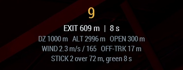
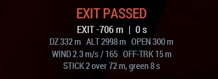

# Jump run

CARP works the same problem for people as it does for cargo: where the aircraft has to be
when the stick leaves, so they arrive over the drop zone.

  
  

## Setting it up

1. Set the **DZ** as usual.
2. Set **MODE** to **HALO JUMP**.
3. Set **STICK** (how many are jumping) and **OPEN m** (the height they plan to open at).
   They are on the panel, not in options, because they change every serial. Leave STICK at
   0 to count everyone aboard except the pilot when the run is armed.
4. Roll out on your run-in heading and press **RUN-IN** to lock it, exactly as for cargo.
5. Press **ARM JUMP RUN**.

## What everybody sees

Everyone aboard gets the readout, whether they are in a seat or standing at the ramp.

| Readout | Meaning |
| --- | --- |
| `STAND BY` | Armed and inbound. Shows distance and time to the exit point. |
| A counting number | The audible countdown, 10 s by default. |
| `GO` | Green light. Get out. |
| `EXIT PASSED` | The exit point is behind the aircraft. |

The lines underneath are the jump itself: distance to the DZ, aircraft height, planned
opening height, wind, how far off track the aircraft is, and how the stick is spread —
`STICK 2 over 72 m, green 8 s`.

  
  

The jumplight in the back goes green at the exit point and stays green long enough for the
last man out, based on your stick size and jumper interval. Driving the light needs
[Free Fall Off The Ramp](https://steamcommunity.com/workshop/filedetails/?id=2654268308);
without it the readout and countdown still work.

## It will refuse a green light

If the aircraft is not tracking the run-in, the exit point can be a kilometre off to one
side, and a green light there is worse than none. CARP holds the light red, says so, and
asks the pilot to correct. Fix the cross-track and the track error and it goes green.

## Tuning it

All under Addon Options → TLB CARP → [Jump Run](SETTINGS.md#jump-run), and all
server-forced so a unit can standardise them.

| Setting | Default | Why you would change it |
| --- | --- | --- |
| Jump Opening Altitude | 600 m | Higher opening leaves more room to glide onto the DZ; lower needs a more accurate exit. |
| Jumpers In Stick | 0 (count aboard) | Fix it when some passengers are not jumping. |
| Jumper Interval | 1 s | Longer interval spreads the stick further along the run-in. |
| Jump Countdown | 10 s | How much warning the stick gets. |
| Green Light Duration | 8 s | How long the light stays green after the exit point. |
| Early Exit Bias | 250 m | Exit early on purpose. Flying downwind to the DZ is far faster than flying upwind to it, so an early exit is recoverable and a late one usually is not. |
| Jump Exit Bias | 0 m | Only if jumpers consistently land long or short along the run-in. |

## Flown results

Two cue-flown jumps landed **7 m** and **12 m** from the mark, inside a 200 m box. As with
everything else here, those are measurements rather than estimates: both were flown, and
the numbers are what the recorder reported.
