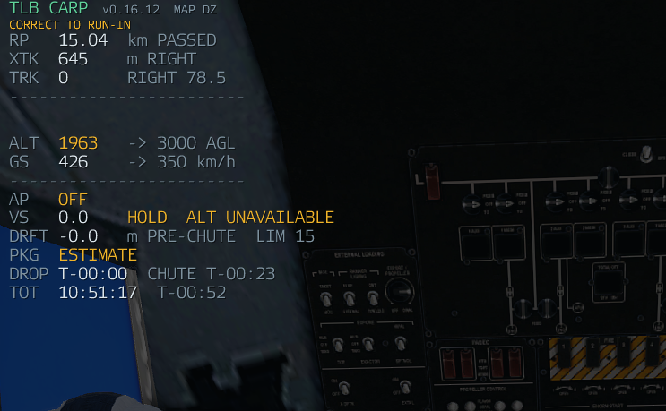

# Pilot guide

Everything you need to fly a drop, in the order you do it.

  

## Before you start

- **Carry a CARP Computer.** It is an item in the Arsenal. Without it there is no CARP
  entry in your interaction menu and you do not share the crew's drop. A mission can turn
  that requirement off.
- **Any aircraft will fly a drop.** The C-17 and the C-130J are calibrated; anything else
  borrows a profile, always reports **DEGRADED** and says so on the HUD.
- **On a server, the mod has to be on the server too.** Cargo is usually owned by the
  server, and that is the machine that performs the release.

## Opening CARP

Sit in the aircraft, press **Interact** aimed at the airframe, and choose **TLB CARP**.
Or bind **Open TLB CARP** under *Options → Controls → Configure Addons → TLB CARP*.

There are two surfaces and they do different jobs. The **panel** is where you set a drop
up. The **HUD** is the instrument you fly — once guidance is armed the panel can stay shut.

## 1. Load the cargo

Walk up to **the vehicle**, not the aircraft: the load action sits on the thing being
loaded and works out which aircraft you mean.

CARP drops cargo from four places, and all four drop the same way:

| Loaded by | Notes |
| --- | --- |
| CARP's own load action | Walk to the vehicle → *Load into aircraft* |
| The USAF cargo system | Optional mod; its loads are recognised |
| ACE cargo | Objects only — ACE's *virtual* class-name entries cannot be dropped |
| Vehicle-in-vehicle | The engine's own ramp and capacity rules |

Loads stack forward from the ramp and come out **back to front**, so the one nearest the
ramp is the first one out. Unloading is refused above **3 m** — the drop is the only way
cargo leaves a flying aircraft.

## 2. Set the drop up

**DROP ZONE.** Pick a `DZ_*` marker from the list, or press **SET ON MAP** and click your
point. **CLEAR** wipes it.

**MISSION.**

| Field | What it means |
| --- | --- |
| MODE — TOUCHDOWN ON DZ | The load lands on your point. This is what you want for cargo. |
| MODE — CHUTE ON DZ | Canopy *opening* happens over the point instead. |
| MODE — HALO JUMP | Switches to a jump run. See the [jump run guide](JUMP_RUN.md). |
| AIRCRAFT | Leave on AUTO DETECT unless you are deliberately forcing the C-17 or C-130 profile. |
| TARGET AGL / TARGET GS | The height and ground speed you intend to run in at. Press **APPLY**. |

Target height and speed are a **plan, not a constraint**. If you arrive higher or faster,
the release point moves to match — they are what the autopilot flies to, not limits on the
maths.

**ENVIRONMENT.** Manual wind, for missions whose weather CARP cannot read. Most of the
time leave it alone: it reads the engine wind directly.

**CARGO.** How many loads this pass drops, plus the **JPADS** and **SMOKE** toggles. Both
are shared with the crew, because they belong to the drop rather than to you.

## 3. Lock the run-in

This is the one that catches people.

When you press **RUN-IN**, CARP takes **the direction you are actually travelling at that
moment** and makes it your final drop heading. Not your nose, not a bearing to the DZ —
your ground track, right then.

So roll out on the heading you intend to drop on, let the aircraft settle, *then* lock.
Lock in a turn and you have told CARP your run-in is halfway through a turn.

Once locked you get the run-in line on the map and a release point on it.

## 4. Arm guidance and fly it

**ARM GUIDANCE** lights the HUD.

  

| Row | Meaning |
| --- | --- |
| **RP** | Range to the release point, counting down. Shows `PASSED` once it is behind you. |
| **XTK** | Cross-track: how far off the run-in line you are, and which way. `CENTRE` when you are on it. |
| **TRK** | The locked run-in heading, with the correction to fly — `RIGHT 0.8` means turn 0.8° right. `HOLD` means stay as you are. |
| **ALT** | Your height above ground against the target, e.g. `3041 → 3000 AGL`. |
| **GS** | Ground speed against the target. |
| **AP** | Autopilot state, and the path phase: `INTERCEPT`, `CAPTURE FINAL`, `FINAL RUN`, `RELEASE STABLE`, `POST DROP`. |
| **VS** | Commanded vertical speed, with `ALT CAPTURED`, `ALT HIGH` or `ALT UNAVAILABLE`. |
| **DRFT** | Predicted sideways drift the load would inherit at release, against the limit. |
| **PKG** | Package state: `ESTIMATE`, `RELEASED`, `CHUTE`, `ARRIVED`. |
| **DROP / CHUTE** | Countdown to release, and to canopy opening. |
| **TOT** | Time on target — clock time the load arrives, and the countdown to it. |
| **STK** | Stick size, when you are dropping more than one. |

Fly it like an ILS: centre the cross-track, get the track correction to `HOLD`, and have
the numbers small before the count runs out.

  
  

**STANDBY** appears as the release approaches, and the HUD turns green at
**RELEASE STABLE** — that is the pass the gate will accept.

## 5. Let the autopilot fly it (optional)

**AP** intercepts the run-in line, captures it, holds your height and speed, and keeps the
aircraft steady through release. It flies with control forces, so it banks and pitches like
an aeroplane rather than being dragged onto a rail.

It is yours again the moment you touch the controls, and it tells you why it disconnected.
Opening the map or using freelook does not disconnect it. How gentle it is lives in Addon
Options → TLB CARP → [Autopilot](SETTINGS.md#autopilot).

## 6. Drop

**AUTO DROP** releases at the right instant. It is red when off and green when armed.

It will refuse. Inside the final stretch CARP checks that you are within **25 m** of the
line, within **2°** of the locked heading, and that the load will not inherit a large
sideways drift. Miss one and it does not drop, and the HUD tells you which.

  

That is deliberate: a load released off the line misses by about as much as you were off.
Go around and fly it again.

Prefer to do it by hand? Leave AUTO DROP off and release on the cue.

## 7. After the load is away

The HUD keeps tracking it: `RELEASED` → `CHUTE` → `ARRIVED`, with the time on target
rebased on the real canopy event rather than the prediction.

**SMOKE** marks the load on the way down so the people on the DZ can see it coming — one
shell per load, however many players are watching.

## Sticks

Set the **CARGO** number and one pass drops that many, spaced along the run-in in the order
they were packed, nearest the ramp first.

## Guided cargo (JPADS)

**JPADS** makes each load steer itself onto the drop zone after its canopy opens, which
takes most of the wind error out of the problem.

- It waits until the canopy is open and settled before steering — steering during inflation
  would eat the forward throw the release point is built around.
- It eases off in the last 25 m so the load comes down with the air instead of sliding in
  sideways.
- In a stick, each load gets its own slot along the run-in so they do not land on top of
  each other.

In bulk testing guided loads landed inside about a metre. That was measured with the
steering running on a client, so treat it as very good rather than exact.

## Quick reference

| You see | It means |
| --- | --- |
| `CORRECT TO RUN-IN` | You are not on the line yet. |
| `ON RUN-IN` | On the line, inside tolerance. |
| `CAPTURE FINAL` / `FINAL RUN` | The path manager is capturing, then holding, the final line. |
| `RELEASE STABLE` | The gate will accept this pass. |
| `NO DROP — GO AROUND` | The gate refused. Reposition and run it again. |
| `ALT HIGH` / `ALT UNAVAILABLE` | You are above the target height, or there is no valid vertical solution. |
| `DEGRADED` | Uncalibrated airframe or a solver warning. It still solves; expect less accuracy. |
| `[OBSERVING]` | This client is not the one flying the aircraft. |
